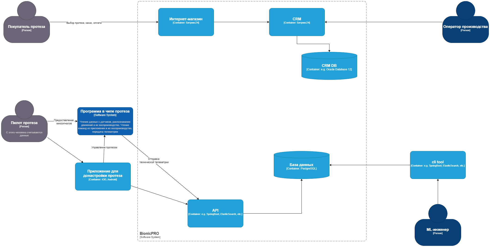
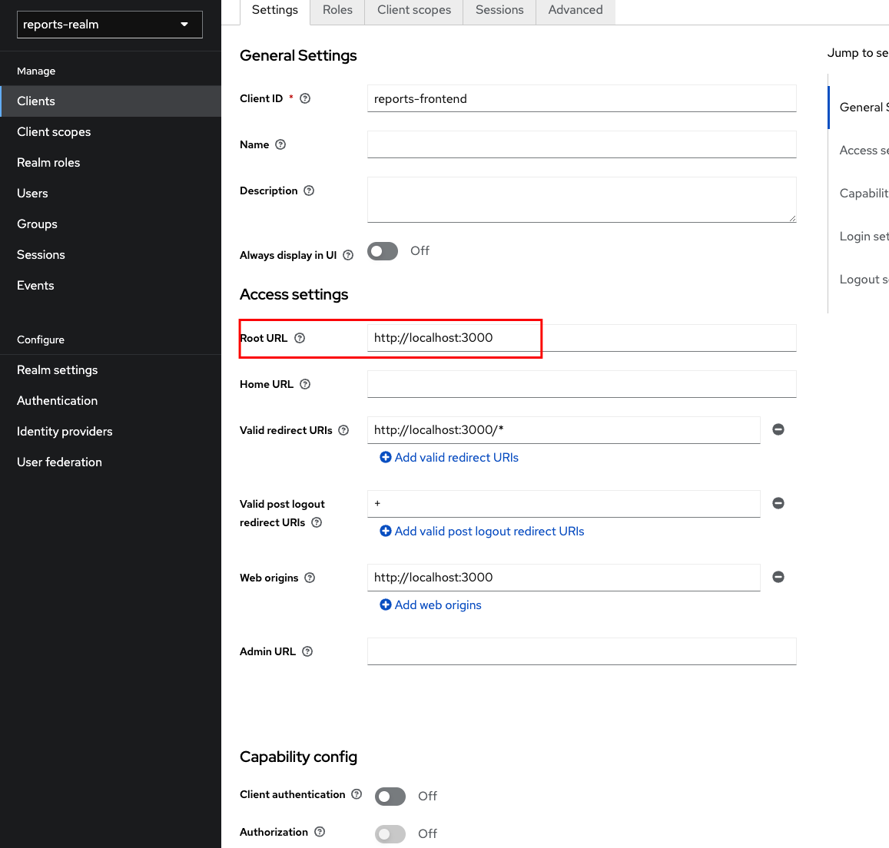
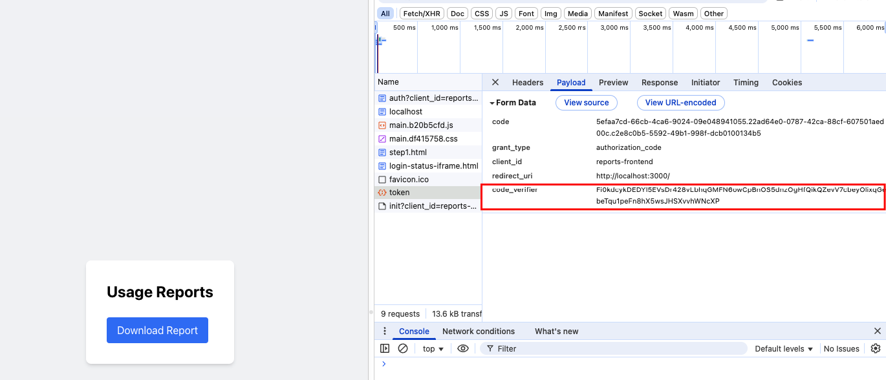

## Ссылки

[Первичный репозиторий yandex-practicum](https://github.com/Yandex-Practicum/architecture-bionicpro)
[Задание](https://practicum.yandex.ru/learn/software-architect/courses/98329273-5b39-4897-949d-07251363463c/sprints/471656/topics/1b28da3c-eb7b-4324-b149-0f15173252ed/lessons/ca037980-a93c-4caa-9adb-a4ecf1371e44/)

## Как работают протезы

Каждый бионический протез состоит из шести компонентов:

- **Миодатчики**. Они считывают миосигналы с мышц, которые остались выше культи. Миосигналы — это биоэлектрические сигналы, возникающие в результате электрической активности мышц.
- **Чип типа ESP32**. Он считывает данные с миодатчиков. В чипе установлена программа на C++. Она анализирует миосигналы и по ним определяет, какое действие нужно совершить. Затем она посылает сигнал актуаторам.
- **Актуаторы**. Это исполнительные устройства, которые преобразуют электрическую энергию в механическую. Они позволяют протезу выполнять движения, которые соответствуют командам пользователя.
- **Батарея**. Это источник питания, который обеспечивает энергией все компоненты протеза.
- **Система управления батареей**. Она контролирует заряд и разряд батареи, а также предотвращает её перегрев и перегрузку.
- **Корпус**. Это оболочка протеза, которая защищает его компоненты от внешнего воздействия.

## Как изготавливают протез

Процесс выглядит так:

1. Пациент заказывает у компании протез и оплачивает его.
2. После оплаты пациент приходит на первичный замер, чтобы сделать слепки ампутированной конечности. По слепкам делают культеприёмник, который вставляют в протез.
3. Протез изготавливают от одного до двух месяцев. В это время пациент должен периодически посещать компанию и проводить примерки протеза.
4. Когда протез изготовлен, пациент приходит на финальную примерку.
5. Если во время финальной примерки не запланировали новые доработки, то начинается серия обучений для пользователя. В это время команда записывает индивидуальные миосигналы пациента на протез.

Но на этом работа над протезом не заканчивается.

Одно из важнейших свойств протеза — это скорость реагирования. Желательно, чтобы она не превышала 100 миллисекунд. В противном случае протезом будет сложно пользоваться.

Обеспечить высокую скорость реагирования непросто. Миодатчики сами по себе производят много шума в данных. Это происходит из-за того, что миосигналы достаточно слабые. Их могут искажать электромагнитные помехи от электронных устройств, механические вибрации и даже нестабильная работа батареи.

При этом миосигналы каждого человека уникальны. А ещё они меняются с течением времени. 

Буквально через месяц после первичной настройки протеза миосигналы могут поменяться.

Чтобы повысить скорость реагирования, программу распознавания движения помещают на сам протез — в чип. А чтобы она правильно интерпретировала сигналы мышц, её периодически приходится донастраивать.

## Как донастраивать протез

Для этого в BionicPRO разработали приложения на Android и iOS. Они позволяют пилоту протеза самостоятельно донастраивать протез в процессе эксплуатации.

Компании важно, чтобы алгоритмы распознавания движения работали как можно быстрее. Чтобы улучшить свою ML-модель, BionicPRO собирает и хранит информацию о сигналах и движениях протеза по всем своим пользователям. Чип отправляет данные через 4G-модуль.

Изначально компания получала данные с протезов раз в день. Но недавно она переключилась на сбор данных в режиме реального времени. Пользователи могут отключить эту функцию.

## О компании

В компании пять отделов:

* Отдел продаж.
* Отдел производства и эксплуатации.

* Отдел маркетинга.
* Отдел машинного обучения (ML).

* Отдел разработки.

В IT-системе BionicPRO четыре ключевых компонента:

- Программа в чипе протеза.
- Приложение для донастройки протеза.
- Интернет-магазин.
- CRM.

[Ссылка на диаграмму](BionicPRO_C4_Model.drawio)

### 1. Проблемы и бизнес-задачи компании

В последнем уроке первой темы мы реализовали для компании SSO через Oauth2.0 Code Grant в Keycloak. С тех пор компанию успели взломать. И это несмотря на то, что мы использовали Code Grant.

Хакеры воспользовались уязвимостью и скачали персональные данные пользователей по всем протезам. Ходит слух, что утечка дошла до конкурентов BionicPRO и они уже знают, сколько активных пользователей есть у компании.

Когда информация о взломе достигла СМИ, клиенты BionicPRO подали в суд на компанию. Если не урегулировать конфликт в досудебном порядке, есть риск, что компании придётся заплатить большие штрафы.

Директор BionicPRO в срочном порядке созвал собрание руководителей. В ходе обсуждения наивысший приоритет отдали задачам по усилению безопасности.

Также нужно учесть, что пользователи узнали о сборе данных и теперь хотят получать больше информации о работе своих протезов. Они требуют, чтобы разработчики добавили в приложение возможность скачать отчёт. Чтобы урегулировать судебные иски, компания пошла на уступки и пообещала предоставить такую функциональность для пользователей Android-приложения.

Вот ещё несколько важных проблем, с которыми столкнулась компания:

* **Огромный объём данных.** Изначально у компании была только одна база данных — PostgreSQL. Очень быстро она начала ухудшать показатели работы системы. Команда попробовала использовать индексы, но это не помогло: большое количество данных начало влиять на остальные таблицы базы.
* **Выход на новые рынки и соблюдение требований законодательства.** Компания сейчас работает только в РФ, но планирует осваивать новые рынки и развивать свои продукты в других странах. BionicPRO работает с медицинскими данными, и во многих странах есть требования к хранению такой информации. Нужно учитывать, что правовое регулирование в разных странах может отличаться. Важно продумать, как будут храниться данные о пациентах, в том числе — авторизационные.

## **2. Цели бизнеса**

* Злоумышленники не могут использовать уязвимость SSO в приложении.
* Пользователи могут скачать данные о работе протеза в виде отчёта. Чтобы реализовать эту функциональность, нужно выгружать данные из CRM в ClickHouse. Для этого требуется написать отдельное приложение, которое сможет предоставлять отчёт из нескольких источников — CRM и DB.
* Пользователь должен иметь доступ только к тем отчётам, которые содержат данные о его протезе или протезах. У него не должно быть доступа к информации о других пользователях.

# **Задание**

Вам нужно улучшить безопасность приложения, заменив Code Grant на PKCE. Затем необходимо подготовить API для работы с отчётом.

## Что нужно сделать

1. **Реализуйте PKCE.** Его нужно добавить к существующим приложениям — фронтенду и Keycloak. Мы специально не рассказывали в теории, как это сделать. Чтобы разобраться, изучите [официальную документацию](https://www.keycloak.org/docs/latest/server_admin/index.html#device-authorization-grant).
2. **Создайте бэкенд-часть приложения для API.** Выберите удобный для вас язык — Python, Java, C# или любой другой. Добавьте API `/reports` в этот бэкенд для передачи отчётов. Тут не требуется поход в базы данных, ограничьтесь генерацией произвольных данных.

## Перед отправкой задания проверьте, что:

1. Бэкенд отдаёт данные только пользователям с ролью `prothetic_user`. Эту роль мы добавили в последнем уроке первой темы.
2. Бэкенд проверяет валидность подписи токена. Если валидация не прошла, он выдаёт ошибку  `401`.

# Как сдать работу

Подготовьте пул-реквест со всеми изменениями, которые требуются для выполнения задания. После решения в репозитории должны быть:

* Папка «API», а в ней — код, связанный с API.
* В ту же папку нужно добавить Dockerfile, который описывает сборку приложения.
* В docker-compose должен появиться обновлённый код для настройки и запуска API.
* Код для фронтенда должен обновиться в соответствии с PKCE flow.

Перед отправкой решения проверьте, что вы включили в пул-реквест все нужные файлы. Если всё готово, отправьте ссылку на пул-реквест во вкладке «Ревью».

Не забудьте проверить, что репозиторий публичный. Если создадите приватный репозиторий, ревьюер не сможет прокомментировать ваше решение и вернёт его на доработку.

После того как отправите ссылку, не вносите изменения в проект. Дождитесь комментариев ревьюера.

## Результат работы

1. Вместо `API` папки добавлена `backend`
2. Внутри есть dockerfile
3. Дополнен docker-compose.yaml сервисом backend.
4. На Keycloak добавлены записи:
   
5. Код фронтенда обновлен.
   